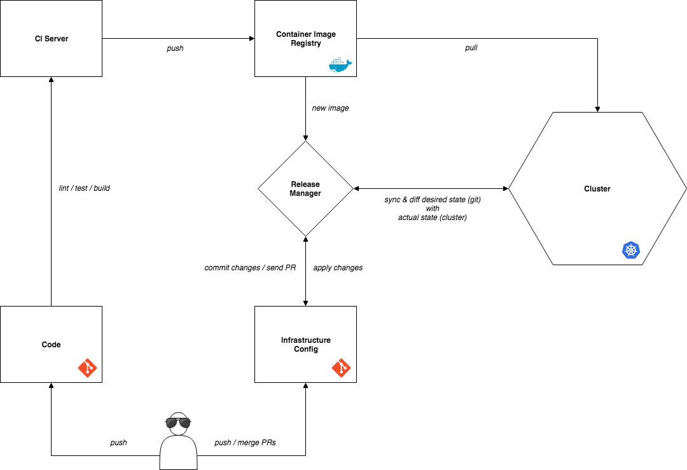

# The GitOps Manifesto [wip]

**Empower developers to do operations.**

While researching CI/CD workflows and DevOps practices for cloud native applications using _Microservices_, _Docker_ and _Kubernetes_,
I stumbled upon [GitOps](https://www.weave.works/blog/gitops-high-velocity-cicd-for-kubernetes).

I'm using this repo to create an overview of all things I'm learning about this subject.

## What is GitOps

> "GitOps is short for _Git Ops_. It is a name for a set of Ops practices using Git. The spirit of the name is to be like DevOps — something that anyone can do rather than being _a product_." - [Alexis Richardson](https://twitter.com/monadic)

GitOps is a name coined by [Weaveworks](https://www.weave.works/) which describes how developers use
tooling to drive operations. It builds on DevOps best practices, allowing developers to operate Kubernetes
via Git instead of tools like `kubectl`.

> "kubectl is the new ssh." - Kelsey Hightower

This is possible because Git is used as the single source of truth for the desired state of your
entire system.

The fundamental theorem of GitOps is:

> Only what can be described and observed can be automated and operated.

## Why

When the desired state of a system is version controlled and used as the single source of truth, we
get all the benefits of Git and Pull Request based workflows:

* history
* possibility to revert changes
* reviews
* comments
* possibility to link to issues, Pull Requests, stories, etc.

This makes the entire system more _transparent_, _discoverable_, _easier to operate_, _recoverable_
and _observable_. These attributes help us to reliably deliver quality software at a high velocity
in order to innovate, stand out in the market and be cost efficient.

> "When we say _high velocity_ we mean that every product team can safely ship updates many times a day — deploy instantly, observe the results in real time, and use this feedback to roll forward or back. The goal is for product teams to use [continuous experimentation](https://blog.acolyer.org/2017/09/29/the-evolution-of-continuous-experimentation-in-software-product-development/) to improve the customer experience as fast as possible." - [Alexis Richardson](https://twitter.com/monadic)

security

testing in prod

## How

By making _Git_ the source of truth of the _desired state_ of the system and making _Obersvability_
the source of truth of the _actual running state_ of the system, we can use the _Operator Pattern_
to control the actual state so that it will reflect the desired state. This is achieved by listening
for certain Git tags to be _pushed_ and in turn orchestrate service deployments to the cluster.
Tools like [Weaveworks Flux](https://github.com/weaveworks/flux) do this.

> “Ideally if I make a code change, all I want is a URL to tell me where it’s running. You get bonus points if you can give me metrics to tell me how well it’s running." - [Kelsey Hightower](https://twitter.com/kelseyhightower)

Push vs pull deployment

## Requirements

* [Declarative infrastructure as code](https://www.thoughtworks.com/insights/blog/infrastructure-code-reason-smile)
* Immutable deployment artefacts

* Git:

  * Code & config version controlled
  * Rollback functionality
  * Operational changes must be made by Pull Request; don't let CI push updates into the Kubernetes cluster or use `kubectl` by hand
  * Build each container image just once and 'promote' it through each test sequence / environment, do not rebuild each time. But you must still update your declarative config changes in Git.

- Observable & monitorable services
- Diff tools detect/alert divergence
- Sync tools enable convergence
- Completely automated delivery pipeline

## Workflow

## Resources

### Blog Posts

* [GitOps - Operations by Pull Request](https://www.weave.works/blog/gitops-operations-by-pull-request)
* [The GitOps Pipeline - Part 2](https://www.weave.works/blog/the-gitops-pipeline)
* [GitOps Part 3 - Observability](https://www.weave.works/blog/gitops-part-3-observability)
* [GitOps Part 4 - Application Delivery Compliance and Secure CICD](https://www.weave.works/blog/gitops-compliance-and-secure-cicd)
* [GitOps: High velocity CICD for Kubernetes](https://www.weave.works/blog/gitops-high-velocity-cicd-for-kubernetes)
* [How secure is your CI/CD pipeline](https://www.weave.works/blog/how-secure-is-your-cicd-pipeline)

### Videos

* [KubeCon 2017 Opening Keynote - Kelsey Hightower, Google](https://www.youtube.com/watch?v=07jq-5VbxBVQ)
* [KubeCon 2017 - GitOps - Operations by Pull Request - Alexis Richardson, Weaveworks & William Denniss, Google](https://www.youtube.com/watch?v=BSqE2RqctNs)

### Tooling

* [Weaveworks Flux](https://github.com/weaveworks/flux)
* [Weaveworks Kubediff](https://github.com/weaveworks/kubediff)
* [Bitnami Sealed Secrets](https://github.com/bitnami-labs/sealed-secrets)
